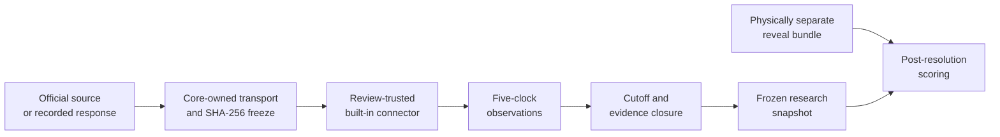

# OpenMacroState

[](https://github.com/alainresearch/OpenMacroState/actions/workflows/ci.yml)
[](https://www.python.org/)
[](LICENSE)

**An auditable, point-in-time operating system for global macro research.**

OpenMacroState is building a way for researchers to reconstruct what could have
been known at a historical cutoff, connect evidence to explicit mechanisms,
record falsifiable claims, and score those claims after outcomes arrive.

> Replay what the world knew, not what history later revised.

## The value in 30 seconds

OpenMacroState turns exact source bytes into a research record that can answer
four questions later: **what was available, when was it available, which claim
used it, and how did the claim score?**

It does this without asking an AI model to remember the boundary:

1. freeze a core-observed official response or separately recorded bytes;
2. hash it and preserve its retrieval metadata without treating a self-reported
   receipt time as historical proof;
3. normalize observations with five distinct time fields;
4. reject evidence that was not eligible at the research cutoff; and
5. keep later outcomes in a separate reveal bundle until scoring is allowed.



OpenMacroState is not another chart terminal and does not claim to predict
markets. Its first official-source pre-alpha vertical slice is the New York Fed
SOFR connector, `frbny-sofr`. It is deliberately conservative:
historical values retrieved today do not become evidence that the system had
captured them in the past. Replaying a recording with an old `retrieved_at`
claim does not restore past availability either: without an authenticated proof,
the core uses the current replay time for eligibility. See the
[connector contract](docs/connectors.md).

## Project status

OpenMacroState is in **pre-alpha development**. Interfaces, schemas, and bundled
cases may change before the first stable release. Today the repository provides
a public research contract, versioned interchange schemas, public plugin
protocols, an executable offline validator/demo, and the first pre-alpha
official-source capture path. That connector is not yet a stable historical
evidence pack. The repository still does **not** ship a production model adapter
or a reviewed real historical replay, and it is not a production trading or
policy system.

## Five-minute synthetic demo

Python 3.10 or newer is recommended.

```bash
git clone https://github.com/alainresearch/openmacrostate.git
cd openmacrostate
python -m pip install -e '.[dev]'

openmacrostate validate cases/2023-banks
openmacrostate demo cases/2023-banks --reveal reveals/2023-banks --evaluation-at 2023-03-13T22:00:00Z --output build/demo
```

A wheel built from the repository also carries this small fixture, so its
shortest smoke test is:

```bash
openmacrostate example 2023-banks --output build/example
```

`cases/2023-banks` is a **synthetic teaching fixture**: every value is invented,
and its date-shaped scenario is not evidence about any real bank or historical
event. It exists to test cutoff enforcement, transitive evidence rejection, and
reveal-gated scoring without a network connection, AI provider, or API key.

The prediction-time research bundle under `cases/` and the post-resolution
reveal bundle under `reveals/` are physically separate and have independent
integrity manifests. `validate` reads only the research bundle; it neither needs
nor reads a reveal. `demo` requires both paths and an explicit evaluation time.
Existing output paths are refused by default; use `--force` only to replace an
empty directory or a marked prior output for the same case.

Run lint and the full test suite with:

```bash
python -m ruff check .
pytest
```

See the [quickstart](docs/quickstart.md) for the expected artifacts and common
troubleshooting steps.

## First official-source capture

The built-in `frbny-sofr` connector exercises the full acquisition boundary
without making network access implicit:

```bash
mkdir -p build
openmacrostate connector capture frbny-sofr \
  --start 2023-03-22 --end 2023-03-22 \
  --recording tests/fixtures/connectors/frbny_sofr/recording.json \
  --output build/frbny-sofr
openmacrostate validate build/frbny-sofr
```

This offline fixture produces six normalized observations and a case bundle
with eight checksummed research files. Its bytes and manifest are reproducible,
but its source and receipt time remain explicitly unverified. Use `--online`
instead of `--recording` only when you intentionally want the core to make one
allowlisted HTTPS request. Live capture is labeled `core_observed_https`; that
is a local acquisition record, not a signed historical timestamp or a causal
claim. See the [connector contract](docs/connectors.md).

## The problem it addresses

Macro research is unusually vulnerable to hindsight:

- economic series are revised after their original release;
- policy documents, market prices, and balance sheets arrive on different clocks;
- narrative explanations are often detached from reproducible calculations;
- failed predictions can quietly disappear or be rewritten; and
- AI systems can produce fluent conclusions without respecting the historical
  information boundary.

OpenMacroState makes the information boundary explicit. A replay should answer:

1. What information was actually public at the cutoff?
2. Which balance sheets or state variables changed?
3. Through which mechanism could the change propagate?
4. What competing explanations remain plausible?
5. Which future observation would weaken or falsify each claim?
6. What happened, and how should the recorded claim be scored?

## Research contract

Every publishable result should be:

- **point-in-time** — later releases and revisions cannot leak into a replay;
- **auditable** — claims resolve to immutable source artifacts and calculations;
- **reproducible** — a documented command rebuilds the result;
- **explicit about uncertainty** — observations, inferences, and forecasts are
  distinguishable;
- **mechanism-first** — accounting boundaries and transmission paths are named;
- **falsifiable** — forward-looking claims include a horizon and evaluation rule.

The core time model keeps five concepts separate: when a value was observed,
released, vintaged, ingested, and the research information cutoff. Cases also
declare either `prospective_capture` or `retrospective_authenticated` availability;
the latter may accept later ingestion only with a verified, pre-cutoff version
proof bound to the exact source, digest, and publication time. The current
pre-alpha verifier accepts only the explicitly synthetic fixture proof; real
late-ingested evidence fails closed. See the
[research contract](docs/research-contract.md).

## AI is optional

The currently implemented deterministic core—checksum verification, cutoff
filtering, evidence-closure checks, snapshots, and reveal-gated scoring—works
without an AI service. AI-assisted components may propose claims, compare
explanations, or draft prose, but they do not get to:

- bypass the replay cutoff;
- invent or silently replace evidence;
- modify frozen artifacts;
- turn an inference into an observation; or
- publish an unsupported claim as fact.

The analysis snapshot contains only eligible plaintext. Quarantined values,
rejected claims, and their future artifact metadata stay in separate validator
diagnostics and are never part of the view supplied to an AI.

AI-generated contributions are welcome when they meet the same review, licensing,
testing, and attribution standards as human-written work.

## Project map

```text
src/openmacrostate/
  api/v1/         public value types, errors, and connector/model protocols
  connectors/     fixed registry of review-trusted built-in connectors
  runtime/        case loading, checksums, cutoff filtering, and scoring
  cli.py          `validate`, `demo`, `example`, and `connector capture`
schemas/v1/       JSON Schema interchange contracts
cases/2023-banks/ synthetic offline teaching fixture (not historical evidence)
reveals/2023-banks/ separate synthetic post-resolution outcome bundle
contrib/templates/ starter skeletons for future connectors, models, and cases
tests/            runtime, CLI, and public-schema contract tests
docs/             research, contribution, and governance documentation
```

The connector and model directories under `contrib/templates/` are extension
templates, not bundled live integrations. Connector execution is fail-closed:
offline recordings are the reproducible default workflow, live network access
must be selected explicitly, and arbitrary third-party Python plugins are not
loaded in this pre-alpha. See [docs/connectors.md](docs/connectors.md).

## Ways to contribute

You do not need to be both an economist and a software engineer. The main
contribution lanes are:

- add or repair a public-data connector;
- build or audit a historical replay case;
- document a mechanism, accounting boundary, or competing explanation;
- adapt a model behind the common interface;
- improve tests, documentation, translations, or accessibility; and
- reproduce an issue, review evidence, or answer a community question.

Start with [CONTRIBUTING.md](CONTRIBUTING.md). Small fixes may go directly to a
pull request; substantial changes to the core protocol begin with an RFC. Project
priorities are described in the [roadmap](ROADMAP.md). Contributors working on
official sources should also read the [connector contract](docs/connectors.md)
and [data-license policy](docs/data-licensing.md).

## Community and governance

GitHub Discussions is the canonical, searchable home for questions, ideas, and
design conversations. GitHub Issues tracks accepted work and defects. Decisions
made in synchronous chats or meetings must be summarized back to GitHub.

OpenMacroState uses a public contributor ladder:

```text
Contributor -> Reviewer -> Module Maintainer -> Steering Council
```

Responsibilities, promotion criteria, decision rules, and succession are defined
in [GOVERNANCE.md](GOVERNANCE.md). Current ownership is recorded in
[MAINTAINERS.toml](MAINTAINERS.toml).

## Releases, security, and citation

- Release policy: [docs/releasing.md](docs/releasing.md)
- Security reporting: [SECURITY.md](SECURITY.md)
- Project citation: [CITATION.cff](CITATION.cff)
- Project charter: [PROJECT_CHARTER.md](PROJECT_CHARTER.md)

## Licensing

Project code and repository-authored documentation are licensed under the
[Apache License 2.0](LICENSE), unless a file states otherwise.

**That license does not automatically apply to downloaded or bundled data.** Each
connector, research case, and reveal bundle must identify source terms,
redistribution status, and required attribution. Data without clear
redistribution permission must be fetched from its source or represented by a
small synthetic fixture. See
[docs/data-licensing.md](docs/data-licensing.md) and [NOTICE](NOTICE).

OpenMacroState provides research infrastructure, not investment, legal, or policy
advice. Source data can be incomplete, revised, delayed, or wrong.

---

## 中文快速介绍

**OpenMacroState 是一个可审计、可回到历史当时的全球宏观研究操作系统。**

它不是另一个行情终端，也不承诺“AI 预测市场”。它首先解决一个更基础的
问题：在某个历史时点，研究者当时究竟能够知道什么？项目把证据的观测时间、
发布时间、版本时间、采集时间和研究截止时间分开，并把结论连接到来源与可证伪
条件。

当前内置的 `2023-banks` 只是**合成教学夹具**：所有数值均为虚构，用来检验
时间截止、证据传递拒绝和事后评分，不构成任何真实银行或历史事件的证据。
它不依赖 AI 或 API Key；AI 只能作为可选分析层，不能越过时间边界，也不能
替代证据。研究包位于 `cases/`，事后揭晓包位于 `reveals/`，二者各自拥有完整性
清单；`validate` 完全不读取揭晓包。代码采用 Apache-2.0，外部数据仍遵守各自
许可证。

首个官方数据纵向切片已以 pre-alpha 纽约联储 SOFR 连接器 `frbny-sofr` 落地。
它采用保守时间规则：今天抓取到的历史值，不会被倒填成系统在当年已经
捕获的证据。详见[Connector 契约](docs/connectors.md)。

快速运行：

```bash
python -m pip install -e '.[dev]'
openmacrostate validate cases/2023-banks
openmacrostate demo cases/2023-banks --reveal reveals/2023-banks --evaluation-at 2023-03-13T22:00:00Z --output build/demo
```

欢迎贡献数据连接器、历史案例、宏观机制、模型适配器、测试、文档和中文内容。
详细说明见[中文项目介绍](docs/zh-CN/README.md)与
[贡献指南](CONTRIBUTING.md)。
