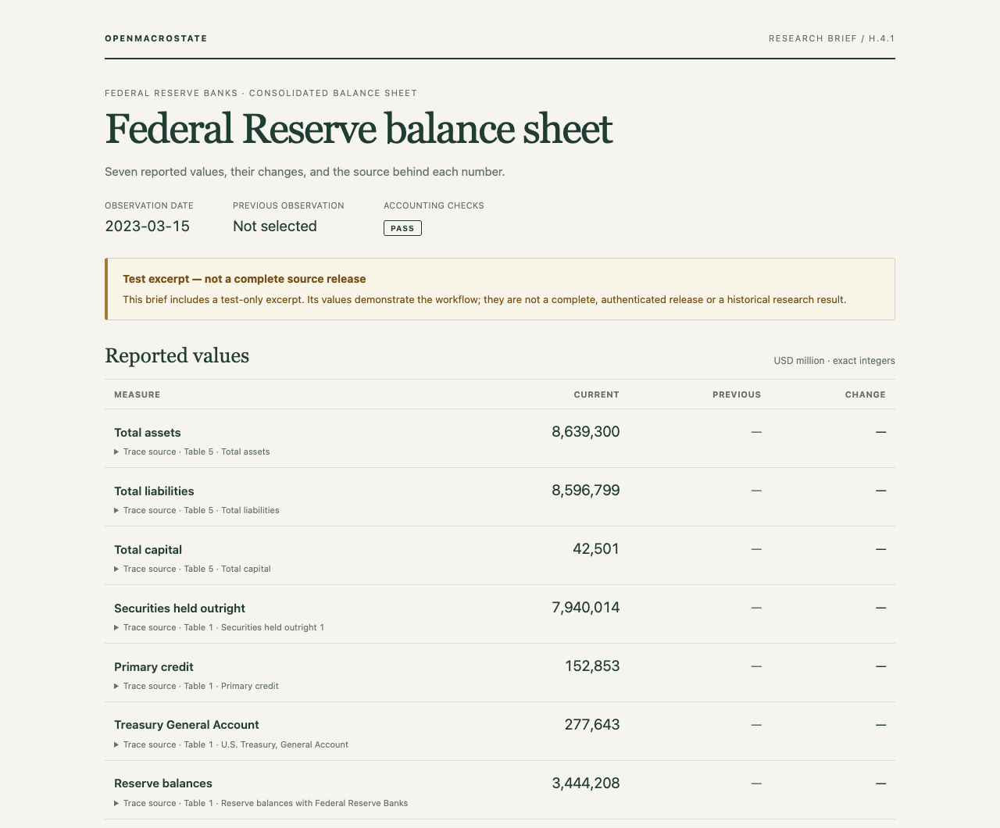
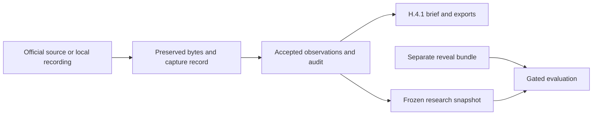

# OpenMacroState

[](https://github.com/alainresearch/OpenMacroState/actions/workflows/ci.yml)
[](https://www.python.org/)
[](LICENSE)
[](https://github.com/alainresearch/OpenMacroState/releases/tag/v0.1.0a7)

**Turn Federal Reserve H.4.1 releases into research briefs with traceable sources.**

Prepare the numbers for a balance-sheet note: seven reported values, a comparison
with a previous capture, and the source records behind them. OpenMacroState
produces a page you can open locally, a table you can copy into a spreadsheet,
and Markdown and CSV exports. Each brief checks the preserved source bytes and
the accounting identity before presenting the data.

Start with one H.4.1 capture. Add a previous capture when you want differences;
the brief distinguishes a new observation period from changes between captures
of the same period. Values remain in the source's `USD_million` unit.



*Offline test-excerpt preview; not an authenticated historical release.*

## Try an H.4.1 brief

Use Python 3.10 or newer and a checkout of the repository:

```bash
git clone https://github.com/alainresearch/OpenMacroState.git
cd OpenMacroState
python -m venv .venv
source .venv/bin/activate
python -m pip install .
```

On Windows PowerShell, activate with `.venv\Scripts\Activate.ps1`.
The [v0.1.0a7 GitHub pre-release](https://github.com/alainresearch/OpenMacroState/releases/tag/v0.1.0a7)
includes the brief workflow. If you only need the installed CLI, you can use its
wheel in an isolated environment instead of cloning the repository:

```bash
python -m pip install "https://github.com/alainresearch/OpenMacroState/releases/download/v0.1.0a7/openmacrostate-0.1.0a7-py3-none-any.whl"
```

The offline H.4.1 example below uses the fixture files in the repository or
source archive; wheel-only users can follow the [explicit online example](docs/quickstart.md#explicit-online-capture).
OpenMacroState is not published to PyPI.

Create your first brief entirely offline:

```bash
mkdir -p build
oms connector capture fed-h41-release \
  --start 2023-03-16 --end 2023-03-16 \
  --recording tests/fixtures/connectors/fed_h41_release/recording.json \
  --output build/h41-capture \
  --brief-output build/h41-brief
```

Open `build/h41-brief/index.html` in your browser. The bundled recording is a
**`test_only_excerpt`** containing seven reported H.4.1 values; the page labels
it accordingly. It demonstrates the workflow without a network connection or AI
key and does not authenticate a 2023 historical version.

| Output | Use it for |
| --- | --- |
| `index.html` | Inspect the seven values, copy the table, and open source/audit details |
| `observations.csv` | Bring the values and any comparison into a spreadsheet |
| `brief.md` | Start a research note with the numbers and source record attached |
| `brief.json` | Inspect the experimental machine-readable report |

The seven values are total assets, total liabilities, total capital, securities
held outright, primary credit, the Treasury General Account, and reserve
balances. A single capture displays the values without inventing a change.

Continue with the [quickstart](docs/quickstart.md) or the
[H.4.1 brief guide](docs/h41-brief.md) for comparisons, explicit online capture,
and the exact checks performed. Use a fresh output directory when repeating
these examples.

## Captures you can inspect later

Three built-in connectors preserve official-source responses and normalize
bounded sets of observations:

| Connector | What it captures |
| --- | --- |
| `fed-h41-release` | Seven Wednesday stock values from one dated Federal Reserve H.4.1 release |
| `frbny-sofr` | The New York Fed's SOFR rate and available volume/percentile data |
| `treasury-debt-to-penny` | Treasury Fiscal Data's total public debt outstanding |

Discover them offline with `oms connector list`. Use `--recording` for local
replay or explicitly select `--online` for an allowlisted HTTPS request. The
[connector guide](docs/connectors.md) includes runnable examples for all three.
The brief workflow currently accepts H.4.1 captures only.

An old date in a source URL does not prove that today's bytes were available on
that date. Captures preserve what the core retrieved or replayed now; historical
eligibility remains false without independently reviewed authentication. This
also applies to a comparison of two dated releases retrieved today. A difference
between two captures is not, by itself, proof of an official revision.

## Inspect the calculation

The H.4.1 brief uses the same fixed audit as the command below:

```bash
oms audit accounting build/h41-capture \
  --rule fed-h41-balance-sheet-v1 \
  --observed-at 2023-03-15T00:00:00Z
```

The audit re-hashes and re-normalizes the local artifact, requires all seven
observations to match, and checks `assets = liabilities + capital` within
exactly 1 `USD_million` for reported whole-million rounding. The
[accounting audit guide](docs/accounting-audit.md) explains the checks.

For a trace of the arithmetic back to its inputs:

```bash
oms trace state build/h41-capture \
  --rule fed-h41-balance-sheet-v1 \
  --observed-at 2023-03-15T00:00:00Z \
  --target balance_sheet_residual
```

This [experimental trace](docs/state-trace.md) describes fixed dependencies;
it does not assert causality or define a stable general state-graph interface.
The brief's JSON output is also experimental and separate from `schemas/v1`.

## The longer-term research system

OpenMacroState is building an auditable, point-in-time operating system for
macro research: preserve evidence, make accounting and mechanisms explicit,
record falsifiable claims, and evaluate them after outcomes arrive. The current
brief is a useful entry point into that work.

The research contract keeps five times separate: observation, release, vintage,
ingestion, and research cutoff. Source records and exact artifact hashes allow
later inspection; evidence closure prevents rejected or late information from
entering an eligible research snapshot. The current official-source connectors
use conservative core retrieval/replay times rather than inventing historical
publication timestamps. See the [research contract](docs/research-contract.md)
and [H.4.1 source contract](docs/fed-h41-source-contract.md).


```mermaid
flowchart LR
    A["Official source or local recording"] --> B["Preserved bytes and capture record"]
    B --> C["Accepted observations and audit"]
    C --> D["H.4.1 brief and exports"]
    C --> E["Frozen research snapshot"]
    F["Separate reveal bundle"] --> G["Gated evaluation"]
    E --> G
```

## Explore the synthetic research demo

The separate `2023-banks` teaching fixture demonstrates cutoff enforcement,
evidence closure, and post-reveal scoring. Its values, claims, and outcomes are
invented; it is not a historical banking case.

```bash
oms validate cases/2023-banks
oms demo cases/2023-banks --reveal reveals/2023-banks \
  --evaluation-at 2023-03-13T22:00:00Z --output build/demo
```

The research bundle under `cases/` and outcome bundle under `reveals/` have
independent manifests. `validate` does not need or read the reveal. A packaged
installation can also run `oms example 2023-banks --output build/example`.
See the [quickstart](docs/quickstart.md#synthetic-research-demo) for its outputs.

## Project status and contributions

OpenMacroState is pre-alpha. The repository has three prospective-capture
connectors, a deterministic validator and synthetic demo, a fixed H.4.1
accounting audit and trace, and the H.4.1 brief workflow. It does not yet ship a
reviewed real historical replay or a production model adapter.

The [unscored H.4.1 primary-credit evidence canary, RFC 0001](https://github.com/alainresearch/OpenMacroState/pull/18),
is Draft and awaits independent evidence, rights, and implementation review.
Its formal comment window has not started. The broader
[state-graph RFC](https://github.com/alainresearch/OpenMacroState/pull/25) is
also Draft and deferred behind that smaller evidence path.

Useful contributions include trying a brief in an actual research workflow,
reporting a reproducible error, reviewing source evidence, and improving
connectors, tests, documentation, or accessibility. Start with
[CONTRIBUTING.md](CONTRIBUTING.md) and the [roadmap](ROADMAP.md).
For development, install the additional tools separately:

```bash
python -m pip install -e '.[dev]'
python -m ruff check .
pytest
```

AI services are optional. They cannot substitute for source evidence, backdate
a capture, or change frozen research inputs. The deterministic workflows above
require no AI service.

## Project map

```text
src/openmacrostate/
  api/v1/          public types and connector/model protocols
  connectors/      fixed registry of reviewed built-in connectors
  runtime/         evidence validation, accounting, briefs, traces, and scoring
  cli.py           command-line workflows
schemas/v1/        versioned interchange contracts
cases/2023-banks/  synthetic research fixture
reveals/2023-banks/ separate synthetic outcomes
contrib/templates/ connector, model, and case starting points
tests/             runtime, CLI, and contract tests
docs/              user guides and research/governance contracts
```

## Community, releases, and licensing

Use [Discussions](https://github.com/alainresearch/OpenMacroState/discussions)
for questions and design ideas, and [Issues](https://github.com/alainresearch/OpenMacroState/issues)
for reproducible defects and scoped work. Decisions and ownership follow
[GOVERNANCE.md](GOVERNANCE.md) and [MAINTAINERS.toml](MAINTAINERS.toml).

- [Release process](docs/releasing.md)
- [Security reporting](SECURITY.md)
- [Project citation](CITATION.cff)
- [Project charter](PROJECT_CHARTER.md)

Repository code and authored documentation use [Apache-2.0](LICENSE). External
data retains its own terms, attribution, and redistribution limits; a brief
export does not grant permission to redistribute raw source material. See the
[data-license policy](docs/data-licensing.md) and [NOTICE](NOTICE).

## 中文快速介绍

**把美联储 H.4.1 发布页里的七项数据，整理成可查来源、可复制到研究笔记的简报。**

先运行上面的离线示例，再打开 `build/h41-brief/index.html`。你可以查看数值、
复制表格，或下载 CSV 和 Markdown。提供前一份采集包后，还能比较差额；页面会
区分“新的观测期”和“同一观测期的两次采集有差异”。所有金额沿用原表的百万美元
单位。

示例使用 `test_only_excerpt` 测试节选。今天抓到旧日期的发布页，只能说明今天
拿到了这些字节，不能证明它们在当年已经可得。当前仓库版本包含简报命令，GitHub
预发布版 `v0.1.0a7` 已包含；可安装 GitHub Release 的 wheel，或按上方步骤从仓库安装。
普通使用无需安装开发依赖；离线 H.4.1 演示夹具位于仓库和源码包中。

项目的长期方向仍是可审计的宏观研究系统：保存来源记录，分清五种时间，把研究
输入与事后结果分开。入门见[快速开始](docs/quickstart.md)和
[H.4.1 简报指南](docs/h41-brief.md)；研究契约和贡献方式见
[文档目录](docs/index.md)与[贡献指南](CONTRIBUTING.md)。
